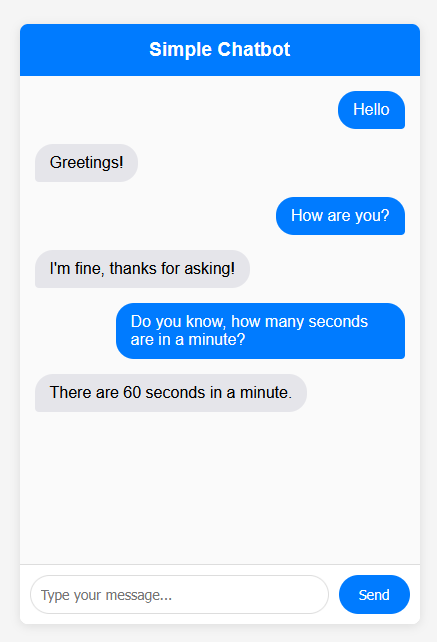

# practice_semester_6

Usage:

1. curl

```
curl -X POST http://127.0.0.1:5000/chat -H "Content-Type: application/json" -d "{\"message\": \"hello\"}"
```

2. web UI (local)

Host frontend on a different port

```
uv run python -m http.server 8000
```


